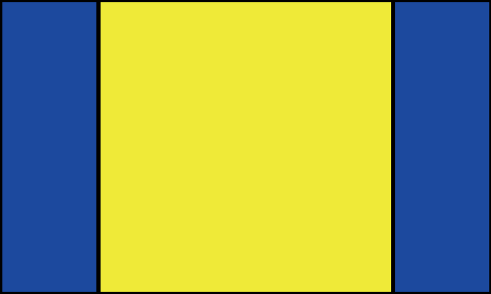
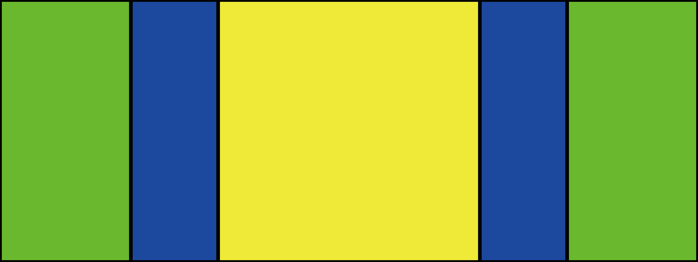
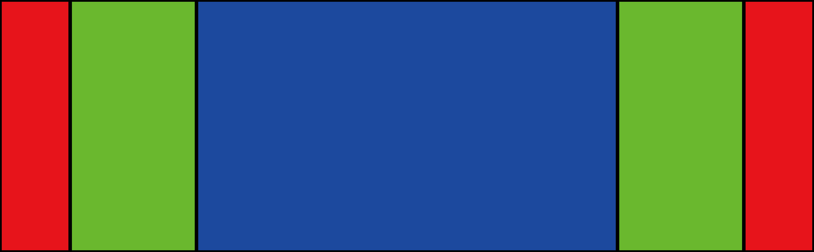

# Appiconset

[](https://badge.fury.io/rb/appiconset)

1024px x 1024pxの画像からmacOSアプリやiOSアプリで必要になるアプリアイコンを書き出すRubyスクリプトです。

以下の環境で動作確認をしています。  
* macOS 15.1

以下のプラットフォームのアイコン作成をサポートしています。
* iOS/iPadOS
* macOS
* Universal
* watchOS
* Android
* tvOS
* icns.iconset
* icns(macOS only)
* favicon

# ガイド

1つの画像から複数のアプリアイコンを作成します。

```
$ appiconset g -i='sample.jpg' -o='output'   
```


## 正方形アイコン
正方形アイコンを作成するには、1024px x 1024px の画像を用意します。

Contents.jsonと複数のpngファイルが作成されます。  
これらのファイルをXcodeプロジェクトの AppIcon.appiconset にコピーします。


## tvOSのアイコン

tvOSアプリ向けのアイコンを作成するには。4640px x 1440px の画像を用意します。  
入力画像から以下の画像を生成します。  
入力画像は tv-top-shelf-wide と同じ、tv-top-shelf は tv-top-shelf-wide から赤の領域が削除された画像、tvはtv-top-shelfから緑の領域が削除された画像になります。

| ディレクトリの名前 | サイズ | 画像 |
|--|--|--|
| tv | 400x1440 |  |
| tv-top-shelf | 3840x1440 | |
| tv-top-shelf-wide | 4640x1440 | |

## 任意のサイズのアイコン

任意のサイズの画像から、1倍、2/3倍、1/3倍のアイコンを作成します。
