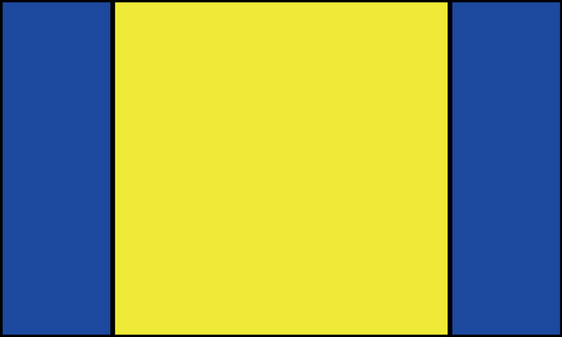

# Appiconset

[](https://badge.fury.io/rb/appiconset)

Ruby script to write app icons required for macOS and iOS apps from 1024px x 1024px images.

We have confirmed the operation in the following environments.
* macOS 15.1

Icon creation is supported for the following platforms.
* iOS/iPadOS
* macOS
* Universal
* watchOS
* Android
* tvOS
* icns.iconset
* icns(macOS only)

# Guide

Create multiple app icons from one image.

```
$ appiconset g -i='sample.jpg' -o='output'   
```

## Square icons

Create an app icon from a 1024px x 1024px image.

A Contents.json and several png files will be created.  
Copy these files to AppIcon.appiconset in the Xcode project.


## tvOS icons

To create an icon for a tvOS app, prepare a 4640px x 1440px image.  
Generate the following image from the input image.  
The input image is the same as tv-top-shelf-wide, tv-top-shelf is the image from tv-top-shelf-wide with the red area removed, and tv is the image from tv-top-shelf with the green area removed.

| Directory name | Size | Image |
|--|--|--|
| tv | 400x1440 |  |
| tv-top-shelf | 3840x1440 | |
| tv-top-shelf-wide | 4640x1440 | |


## Icons of any size

Create 1x, 2/3x, and 1/3x icons from any size image.